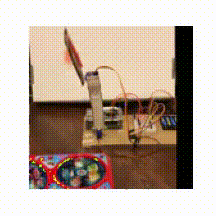

# WorldModel2022 - Application of RSSM to Real World Image Prediction

[English](README.md) | [日本語](README_JA.md)

[](https://opensource.org/licenses/MIT)

## 🌟 Overview

This research evaluates the performance of an RSSM-based model for real-world objects with periodic behavior. The task is to learn how to catch a toy fish with an open mouth on a rotating disk using a simple arm that moves vertically.

## ✨ Demo

Left: Real-world data captured from the experimental setup
Right: Motion prediction using RSSM




## 🚀 Features

- Application of RSSM to real-world objects
- Prediction and control of periodic motion
- Performance evaluation with multiple reward designs
- Real-world validation experiments

## 🛠️ Running on Google Colaboratory

1. Open the notebook in Google Colaboratory:
   - Go to [Google Colab](https://colab.research.google.com)
   - Click "File" > "Open notebook"
   - Select the notebook from this repository

2. The required packages will be automatically installed when you run the notebook.

3. You can also clone this repository directly in Colab:
```python
!git clone https://github.com/tt1717/WorldModel2022.git
%cd WorldModel2022
```

## 🏗️ Project Structure

```
.
├── images/          # Experimental images and GIFs
├── materials/       # Paper, slides, and poster
├── notebook/        # Jupyter notebooks
│   ├── exp001_ver1.ipynb
│   ├── exp001_ver2.ipynb
│   ├── exp001_ver3.ipynb
│   └── exp001_ver4.ipynb
└── README.md
```

## 📈 Training & Evaluation

### Training Data
- 128×128 RGB images
- Arm movement in vertical direction (1D)
- Approximately 2,000 steps of collected data

### Reward Design
1. Random reward
2. Reward based on distance between arm and fish mouth
3. Reward for catching fish
4. Combined reward of distance and catching

## 📝 Usage Examples

1. Experimental Setup
   - Place toy fish on rotating disk
   - Set up vertically moving arm
   - Configure camera environment

2. Data Collection
   - Collect approximately 2,000 steps of motion data
   - Detect fish position through image processing

3. Model Training
   - State prediction using RSSM
   - Predict up to 300 steps ahead

## 📚 Dataset

- Real-world video data
- 128×128 RGB images
- Contains periodic motion

## 🤝 Contributing

1. Fork this repository
2. Create your feature branch (`git checkout -b feature/amazing-feature`)
3. Commit your changes (`git commit -m 'Add some amazing feature'`)
4. Push to the branch (`git push origin feature/amazing-feature`)
5. Open a Pull Request

## 🪪 License

This project is licensed under the MIT License - see the [LICENSE](LICENSE) file for details.

## 📝 Citation

```bibtex
@article{worldmodel2022,
  title={Application of RSSM to Real World Image Prediction},
  author={Toshiro Kusui and Shinya Otani and Tsuyoshi Takano and Kento Fukuda and Junya Honda},
  journal={World Model 2022},
  year={2022}
}
```

## 🙏 Acknowledgements

This research is based on the following studies:

1. [Learning latent dynamics for planning from pixels, ICML 2019](https://arxiv.org/abs/1811.04551)
2. [Dream to control: Learning behaviors by latent imagination, ICLR 2020](https://arxiv.org/abs/1912.01603)
3. [Mastering atari with discrete world models, ICLR 2021](https://arxiv.org/abs/2010.02193)
4. [DayDreamer: World models for physical robot learning, CoRL 2022](https://arxiv.org/abs/2206.14176)
