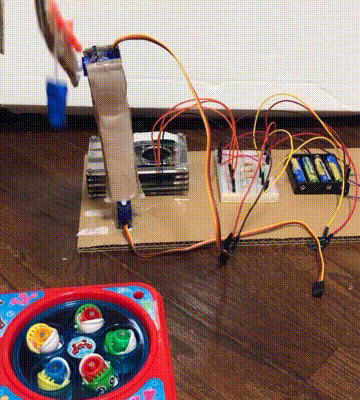
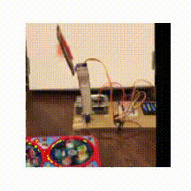

# WorldModel2022 - RSSMの実世界画像予測への応用

[English](README.md) | [日本語](README_JA.md)

[](https://opensource.org/licenses/MIT)

## 🌟 概要

本研究では、周期的な振る舞いをする実世界の物体に対して、RSSM（Recurrent State-Space Model）に基づくモデルの性能を評価します。タスクは、垂直方向に動く単純なアームを使用して、周期的に回転する円盤上で口を開けたおもちゃの魚を釣り上げる方法を学ぶことです。

## ✨ デモ

左：実験装置から取得した実世界のデータ
右：RSSMによる動作予測




## 🚀 特徴

- 実世界の物体に対するRSSMの応用
- 周期的な動作の予測と制御
- 複数の報酬設計による性能評価
- 実世界での検証実験

## 🛠️ Google Colaboratoryでの実行方法

1. Google Colaboratoryでノートブックを開く：
   - [Google Colab](https://colab.research.google.com)にアクセス
   - 「ファイル」>「ノートブックを開く」をクリック
   - このリポジトリからノートブックを選択

2. 必要なパッケージはノートブックの実行時に自動的にインストールされます。

3. リポジトリを直接Colabにクローンすることもできます：
```python
!git clone https://github.com/tt1717/WorldModel2022.git
%cd WorldModel2022
```

## 🏗️ ディレクトリ構成

```
.
├── images/          # 実験画像とGIF
├── materials/       # 論文、スライド、ポスター
├── notebook/        # Jupyter notebooks
│   ├── exp001_ver1.ipynb
│   ├── exp001_ver2.ipynb
│   ├── exp001_ver3.ipynb
│   └── exp001_ver4.ipynb
└── README.md
```

## 📈 学習と評価

### 学習データ
- 128×128のRGB画像
- アームの上下運動（1次元）
- 2,000ステップ程度のデータを収集

### 報酬設計
1. ランダム報酬
2. アームと魚の口の距離による報酬
3. 釣り上げた魚による報酬
4. 距離と釣り上げの組み合わせ報酬

## 📝 使い方サンプル

1. 実験装置のセットアップ
   - 回転する円盤上に魚のおもちゃを配置
   - 垂直方向に動くアームを設置
   - カメラで撮影環境を整備

2. データ収集
   - 2,000ステップ程度の動作データを収集
   - 画像処理による魚の位置検出

3. モデルの学習
   - RSSMによる状態予測
   - 300ステップ先までの予測

## 📚 データセット

- 実世界のビデオデータ
- 128×128 RGB画像
- 周期的な動作を含む

## 🤝 貢献方法

1. このリポジトリをフォーク
2. 新しいブランチを作成 (`git checkout -b feature/amazing-feature`)
3. 変更をコミット (`git commit -m 'Add some amazing feature'`)
4. ブランチにプッシュ (`git push origin feature/amazing-feature`)
5. プルリクエストを作成

## 🪪 ライセンス

このプロジェクトはMITライセンスの下で公開されています。詳細は[LICENSE](LICENSE)ファイルを参照してください。

## 📝 引用

```bibtex
@article{worldmodel2022,
  title={RSSMの実世界画像予測への応用},
  author={楠井俊朗 and 大谷真也 and 高野剛志 and 福田健人 and 本田純也},
  journal={世界モデル2022},
  year={2022}
}
```

## 🙏 謝辞

本研究は以下の研究に基づいています：

1. [Learning latent dynamics for planning from pixels, ICML 2019](https://arxiv.org/abs/1811.04551)
2. [Dream to control: Learning behaviors by latent imagination, ICLR 2020](https://arxiv.org/abs/1912.01603)
3. [Mastering atari with discrete world models, ICLR 2021](https://arxiv.org/abs/2010.02193)
4. [DayDreamer: World models for physical robot learning, CoRL 2022](https://arxiv.org/abs/2206.14176) 